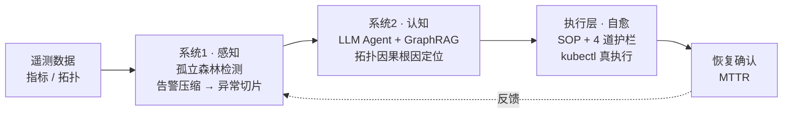

# AIOps Agent · 面向 K8s 微服务的可私有化运维智能体

> 自主完成 **异常检测 → 拓扑根因定位 → 自动自愈** 的闭环运维智能体。基于 **GraphRAG 拓扑因果约束** 让 **7B 本地小模型** 逼近大模型的根因定位能力，全程 **可私有化 / 离线部署**。


-orange)

---

## ✨ 核心亮点

- **真闭环、真自愈**：不止于"诊断"，而是经安全护栏驱动 `kubectl` 真实修复并确认业务恢复。
- **拓扑因果根因定位**：沿服务调用链（`CALLS`）做因果方向推理，区分**根因服务**与被传染的**下游受害者**，输出可解释的故障传播链——而非给候选贴标签。
- **本地小模型可私有化**：运维遥测涉及企业内网，本系统用单卡 7B 本地模型即可运行，无需把数据发往公网大模型 API。
- **证据驱动、可信可控**：故障类型由 LLM 阅读指标证据自行判断（无硬编码阈值）；自愈受 4 道安全护栏约束。

## 🏗 系统架构

"快慢双过程"架构 + 闭环编排：



- **系统1（快）**：孤立森林对全集群遥测打分，把告警风暴压缩成高纯度异常切片。
- **系统2（慢）**：LLM Agent 多轮工具调用，在知识图谱上做拓扑因果推理，定位根因服务。
- **执行层**：根据诊断选 SOP 模板，经命名空间白名单 / 图谱存在性 / 高风险置信度 / 去重四道护栏后真实执行。

## 🧠 核心设计

**1. 拓扑因果根因定位**　调用关系 `(A)-[:CALLS]->(B)` 表示 A 调用 B；下游 B 故障会让上游 A 观测到超时，异常沿调用链向上游传播。因此「自身异常、但依赖的下游都健康」的服务更可能是根因。`cognition/tools/graph_tools.py` 把图谱事实整理成结构化证据（含根因候选），最终判断由 Agent 结合指标证据做出。

**2. 去规则化的证据驱动 Agent**　提示词中不含 `指标>阈值→某类故障` 的硬编码规则；故障类型由 LLM 阅读 `get_service_metrics` 返回的数值证据自行推断。解析失败时诚实返回 `UNKNOWN`，不靠关键词猜测。

**3. 在线检测的两项关键适配**　把离线模型用于在线全集群检测时，做了两项工程适配：① 检测范围限定到核心监控服务（排除预期不稳定的边缘服务，降噪）；② 切片内按「判别性 z-score 峰值」排序嫌疑，输出包含真正根因的高纯度 Top-K 候选集。

**4. 4 道安全护栏**　G1 命名空间白名单 / G2 目标在图谱中存在 / G3 高风险操作需置信度 ≥ 0.85 / G4 同服务同 SOP 5 分钟去重。

## 📁 目录结构

```
aiops/
├── run_demo.py                 # 回放驱动的一键闭环演示
├── aiops/
│   ├── config.py               # 集中配置（端点 + 监控核心服务集）
│   ├── core/contracts.py       # 数据契约 AnomalySlice / Diagnosis / PropagationPath
│   ├── perception/detector.py  # 系统1 在线检测（含两项在线适配）
│   ├── cognition/              # 系统2 认知：agent + prompts + tools(graph/metric)
│   ├── remediation/            # 执行层：sop_planner + sop_executor + 5 个 SOP 模板
│   └── orchestrator.py         # 闭环编排（回放/在线双驱动 + kubectl 恢复确认）
├── graph/build_neo4j_graph.py  # 从 K8s 构建拓扑图谱（含调用链）
├── experiments/                # 混沌注入 + 评测脚本 + 3 个样例实验
│   ├── chaos_injector.py · chaos-yaml/
│   ├── evaluate.py
│   ├── metrics/ · ground-truth/   # 每类故障各 1 个样例（开箱即跑）
└── system1/outputs/            # 训练好的孤立森林模型 + 阈值
```

## 🚀 快速开始

```bash
pip install -r requirements.txt
cp .env.example .env            # 按需填 Neo4j 密码等

# ① 开箱即用：在内置 3 个样例实验上跑系统1 检测 + 候选定位评测（无需 LLM/集群）
python experiments/evaluate.py

# ② 闭环演示（回放驱动，dry-run，不碰真集群）—— 需 vLLM + Neo4j 在线做根因定位
python run_demo.py --parquet experiments/metrics/20260519-171537-cpu-admin-order.parquet

# ③ 真集群模式：构建图谱 → 实时闭环（真执行 kubectl + 真验证恢复）
python graph/build_neo4j_graph.py
python run_demo.py --parquet <...> --live

# ④ 可视化控制台（闭环大盘 + AI 问答）
pip install fastapi "uvicorn[standard]"
python ui_backend/server.py          # 浏览器打开 http://localhost:8088
```

依赖的外部服务：本地 vLLM（Qwen2.5-7B，OpenAI 兼容接口）、Neo4j、Prometheus、K8s（TrainTicket 靶场）。

## 📊 实验与评测

**靶场**：TrainTicket 微服务系统 + Chaos Mesh 真实故障注入（CPU / 网络 / Pod 强杀三类）。

**系统1 · 检测与告警压缩**（67 次注入实验）：

| 故障类型 | 实验数 | 检测率 | 告警压缩率 | MTTD |
|---|---|---|---|---|
| CPU | 31 | 100.0% | 86.1% | 9.2s |
| NETWORK | 30 | 66.7% | 33.0% | 37.5s |
| POD_KILL | 6 | 100.0% | 93.2% | 8.3s |
| **总体** | **67** | **85.1%** | **63.0%** | **19.0s** |

**系统2 · 根因诊断 Acc@1 方法对比**（同基座 Qwen2.5-7B）：

| 方法 | 整体 Acc@1 | CPU | NETWORK | POD_KILL |
|---|---|---|---|---|
| Rule-Based | 64.9% | 96.8% | 10.0% | 83.3% |
| MicroRCA | 43.9% | 48.4% | 30.0% | 66.7% |
| Naive LLM+RAG | 59.6% | 100.0% | 10.0% | 16.7% |
| **本文（双过程）** | **82.5%** | 100.0% | 55.0% | 83.3% |

> **关键结论**：同一基座模型下，本文方法较 Naive LLM+RAG **提升 22.9 个百分点**，证明增益来自方法论（双过程 + 工具调用 + GraphRAG）而非模型规模。网络故障是分水岭（三基线仅 10–30%，本文 55%），与 CNI 层观测盲区的分析相呼应。

**在线服务级候选定位质量**可用 `python experiments/evaluate.py` 复现（在内置样例上：检测率 100%，候选 Acc@3 = 100%）。

## 🛠 技术栈

Python · LangGraph · Qwen2.5-7B（vLLM 本地部署）· Neo4j（GraphRAG）· Prometheus · Kubernetes · Chaos Mesh · scikit-learn（IsolationForest）

## 🗺 Roadmap

- [ ] 自学习事件记忆环：闭环案例写回经验图谱，相似故障越用越快越准
- [ ] 多智能体协同：检测 / 诊断 / 处置 / 反思（Critic）分工
- [ ] 引入分布式追踪（OTel traces）以突破网络故障的指标观测盲区

## 📄 License

[MIT](LICENSE)
